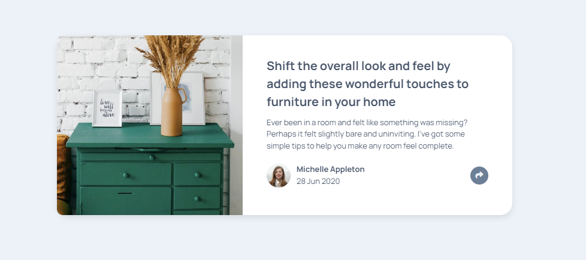

# Frontend Mentor - Article preview component solution

This is a solution to the [Article preview component challenge on Frontend Mentor](https://www.frontendmentor.io/challenges/article-preview-component-dYBN_pYFT). Frontend Mentor challenges help you improve your coding skills by building realistic projects.

## Table of contents

- [Overview](#overview)
  - [The challenge](#the-challenge)
  - [Screenshot](#screenshot)
  - [Links](#links)
- [My process](#my-process)
  - [Built with](#built-with)
  - [What I learned](#what-i-learned)

**Note: Delete this note and update the table of contents based on what sections you keep.**

## Overview

### The challenge

Users should be able to:

- View the optimal layout for the component depending on their device's screen size
- See the social media share links when they click the share icon

### Screenshot



### Links

- Solution URL: https://thomasphpn.github.io/article-preview-component-master/

## My process

### Built with

- Semantic HTML5 markup
- CSS custom properties
- Flexbox
- Javascript

### What I learned

Bottom arrow in the popup

```html
<h1>Some HTML code I'm proud of</h1>
```

```css
.share-popup::after {
  content: "";
  position: absolute;
  top: 100%;
  left: 50%;
  transform: translateX(-50%);
  border-width: 10px;
  border-style: solid;
  border-color: #34495e transparent transparent transparent;
  width: 1px;
}
```
